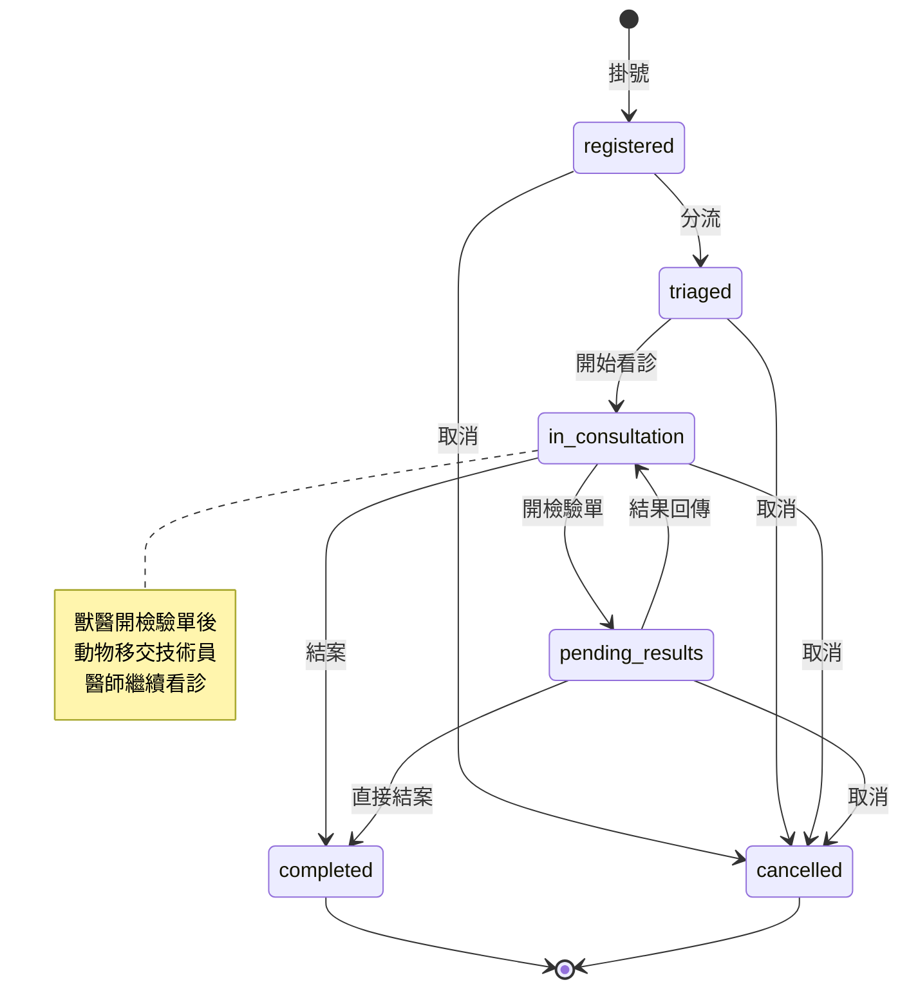

# 獸醫診所 HIS — Entity Relationship Diagram

> GitHub 可直接渲染 Mermaid 語法。若無法顯示，請使用 [Mermaid Live Editor](https://mermaid.live/) 開啟。

---

## 系統全域 ER Diagram

```mermaid
erDiagram
    %% ═══ Foundation ═══
    organizations ||--o{ clinics : "has"
    organizations ||--o{ role_definitions : "has"
    organizations ||--o{ users : "has"

    users ||--o{ user_roles : "assigned"
    role_definitions ||--o{ user_roles : "defines"
    clinics ||--o{ user_roles : "scoped to"

    %% ═══ Owner & Animal（跨院共用，無 clinic_id）═══
    owners ||--o{ owner_contacts : "has"
    owners ||--o{ owner_addresses : "has"
    owners ||--o{ animals : "owns"
    contact_types ||--o{ owner_contacts : "typed by"

    species ||--o{ breeds : "has"
    species ||--o{ animals : "is"
    breeds ||--o{ animals : "is"
    blood_types ||--o{ animals : "has"
    animals ||--o{ animal_diseases : "has"
    animals ||--o{ animal_medications : "takes"

    %% ═══ Visit（綁定分院）═══
    clinics ||--o{ visits : "at"
    animals ||--o{ visits : "receives"
    owners ||--o{ visits : "brings"
    users ||--o{ visits : "attends (vet)"
    visits ||--o{ visit_status_history : "logs"

    %% ═══ Clinical Records（append-only）═══
    visits ||--o{ vital_signs : "recorded"
    visits ||--o{ soap_notes : "documented"
    visits ||--o{ nursing_notes : "observed"
    visits ||--o{ lab_orders : "ordered"
    visits ||--o{ prescription_orders : "prescribed"
    visits ||--o{ medication_administrations : "administered"
    visits ||--o{ procedure_records : "performed"

    soap_notes ||--o{ soap_diagnoses : "contains"
    diagnosis_codes ||--o{ soap_diagnoses : "coded by"

    lab_test_types ||--o{ lab_orders : "tests"
    lab_orders ||--o{ lab_result_items : "results"
    lab_analytes ||--o{ lab_result_items : "measures"

    %% ═══ Catalog 階層 ═══
    lab_categories ||--o{ lab_test_types : "groups"
    lab_test_types ||--o{ lab_analytes : "contains"
    lab_analytes ||--o{ lab_analyte_references : "ranges"

    diagnosis_categories ||--o{ diagnosis_codes : "groups"

    medication_categories ||--o{ medications : "groups"
    medications ||--o{ prescription_orders : "dispenses"
    administration_routes ||--o{ prescription_orders : "via"
    dose_units ||--o{ prescription_orders : "dosed in"
    prescription_frequencies ||--o{ prescription_orders : "at freq"

    procedure_categories ||--o{ procedure_types : "groups"
    procedure_types ||--o{ procedure_records : "performs"

    mucous_membrane_colors ||--o{ vital_signs : "observed"

    %% ═══ AI Assistant 稽核 ═══
    users ||--o{ assistant_sessions : "starts"
    assistant_sessions ||--o{ assistant_messages : "contains"
    assistant_messages ||--o{ assistant_risk_flags : "flagged"

    %% ═══ Entity Definitions ═══
    organizations {
        int id PK
        varchar name
    }
    clinics {
        int id PK
        int organization_id FK
        varchar name
        boolean is_active
    }
    users {
        int id PK
        int organization_id FK
        varchar full_name
        varchar email UK
        varchar license_number "獸醫執照"
        boolean is_active
    }
    role_definitions {
        int id PK
        varchar role_key UK "vet nurse tech recep admin"
        varchar display_name
    }
    user_roles {
        int id PK
        int user_id FK
        int role_definition_id FK
        int clinic_id FK "NULL=全集團"
        timestamptz revoked_at "NULL=有效"
    }

    owners {
        int id PK
        int organization_id FK
        varchar full_name
        varchar national_id "partial unique"
        boolean is_active
    }
    animals {
        int id PK
        int owner_id FK
        int species_id FK
        int breed_id FK
        int blood_type_id FK
        varchar sex "CHECK constraint"
        varchar microchip_number "partial unique"
        date date_of_birth
    }

    visits {
        int id PK
        int clinic_id FK
        int animal_id FK
        int owner_id FK
        int attending_vet_id FK
        varchar status "state machine"
        varchar priority "normal urgent"
        text chief_complaint
        timestamptz registered_at
        timestamptz completed_at
    }
    visit_status_history {
        int id PK
        int visit_id FK
        varchar from_status
        varchar to_status
        int changed_by FK
        timestamptz changed_at
    }

    vital_signs {
        int id PK
        int visit_id FK
        decimal weight_kg
        decimal temperature_c
        int heart_rate
        int respiratory_rate
        boolean is_superseded "append-only"
    }
    soap_notes {
        int id PK
        int visit_id FK
        text subjective
        text objective
        text assessment
        text plan
        boolean is_superseded "append-only"
    }
    soap_diagnoses {
        int id PK
        int soap_note_id FK
        int code_id FK "nullable"
        text free_text "nullable"
        boolean is_primary
    }
    lab_orders {
        int id PK
        int visit_id FK
        int test_type_id FK
        varchar status "pending resulted cancelled"
        boolean is_superseded "append-only"
    }
    lab_result_items {
        int id PK
        int lab_order_id FK
        int analyte_id FK
        decimal numeric_value
        varchar text_value
        boolean is_superseded "append-only"
    }
```

---

## 就診狀態機

---

## 表分類說明

| 分類 | 表 | 特性 |
|------|-----|------|
| **Foundation** | organizations, clinics, users, role_definitions, user_roles | 系統基礎，全域共用 |
| **跨院共用** | owners, owner_contacts, owner_addresses, animals, animal_diseases, animal_medications | 無 `clinic_id`，任何分院可存取 |
| **院所隔離** | visits, visit_status_history, 所有 clinical 表 | 有 `clinic_id`，跨院查詢透過 `animal_id` |
| **Catalog（內部管理型）** | species, breeds, blood_types, diagnosis_categories, diagnosis_codes, lab_categories, lab_test_types, lab_analytes, medications, procedure_types 等 | `is_active` 停用而非刪除 |
| **Append-only** | vital_signs, soap_notes, soap_diagnoses, nursing_notes, lab_orders, lab_result_items, prescription_orders, medication_administrations, procedure_records | `is_superseded` + `superseded_by`，不可修改 |
| **稽核** | visit_status_history, assistant_sessions, assistant_messages, assistant_risk_flags | 紀錄行為變更，事後可追查 |
